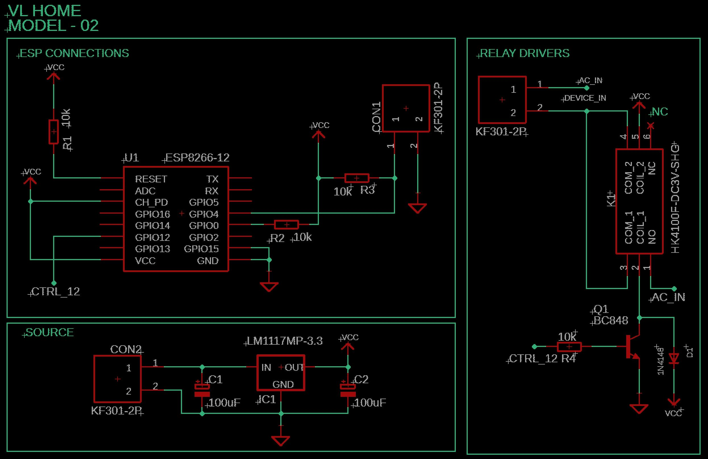
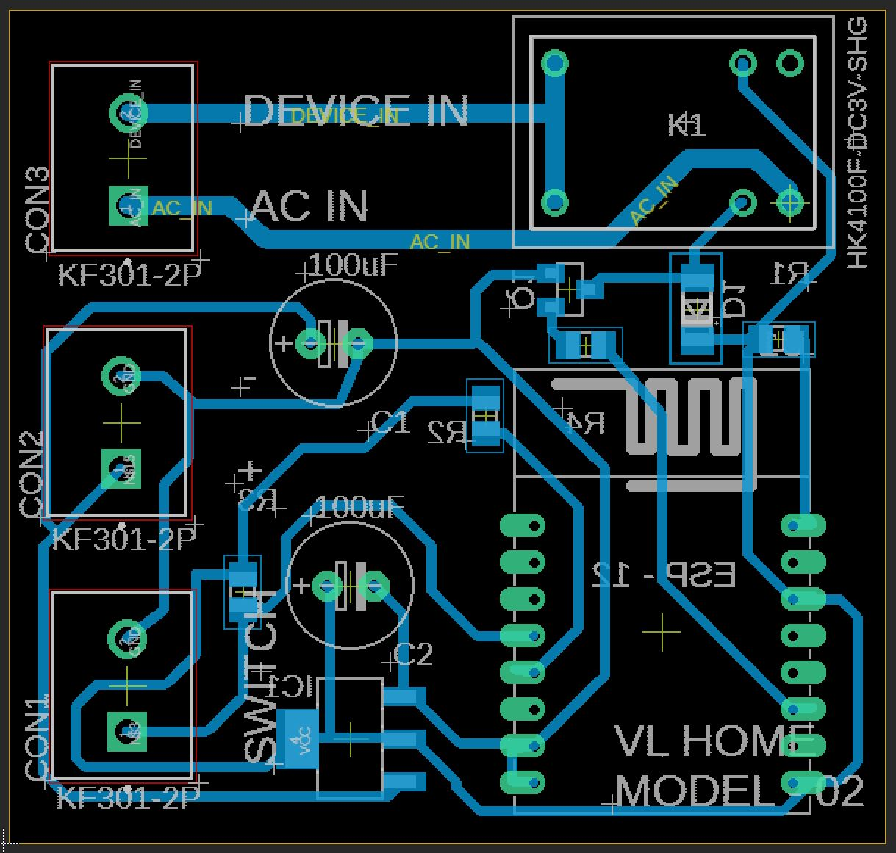
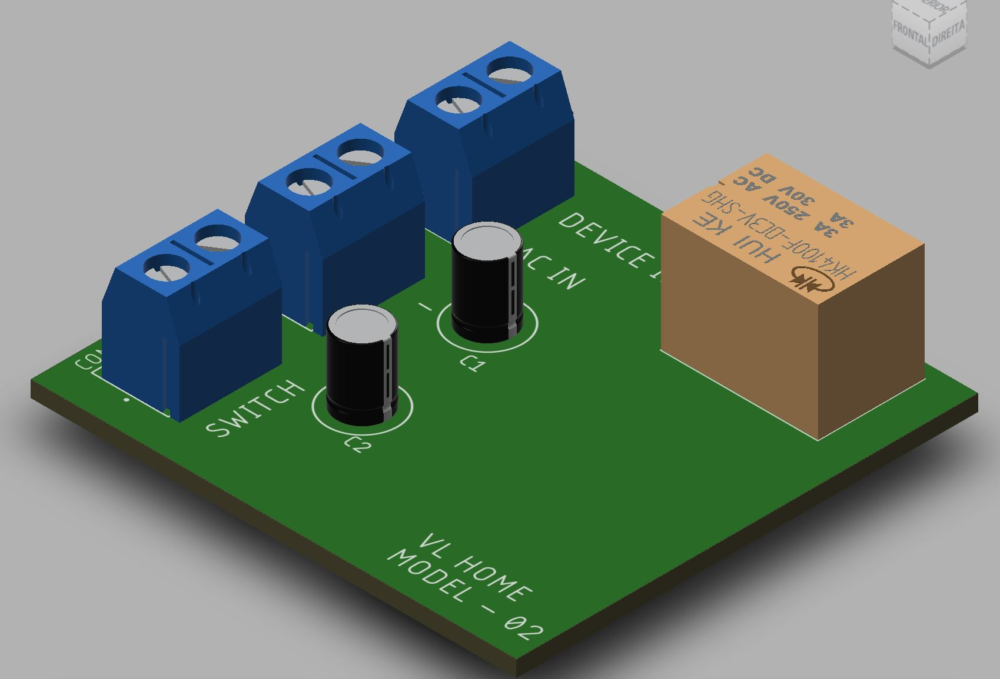
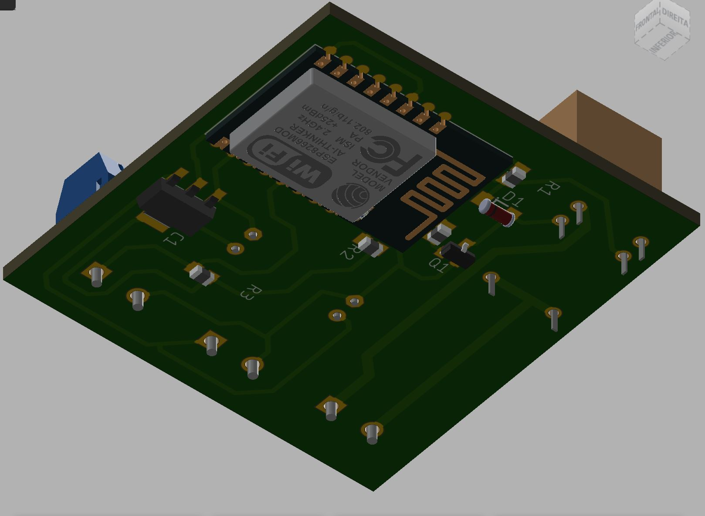

# VLHOME Hardware Firmware - MODEL 02

Dispositivo acionado remotamente via Wifi com conexão a banco de dados do Firebase

## Projeto

Este software foi desenvolvido para uso no microcontrolador ESP8266-12 (4Mb flash) para controle de um dispositivo de alta tensão e conexão de um interruptor de acionamento físico.

## Funcionamento

O dispositivo pode ser acionado por três modos diferentes:

### > Aplicativo
Através do uso de aplicativo próprio:  [VLHome App](https://github.com/vilelalabs/vlhome) 

### > Webpage
Através de webpage pelos dos endereços:

|Link |Função|
|:----------:|:----------:|
|http://IP-do-dispositivo/|home page confirmando a conexão|
|http://IP-do-dispositivo/update|atualização via OTA|
|http://IP-do-dispositivo/toggle|inverte o status atual do dispositivo|
|http://IP-do-dispositivo/hostname|mostra o host name do dispositivo|

> exemplo: http://192.168.1.225/update

### > Interruptor

Pode ser acionado fisicamente atráves do interruptor físico ligado ao conector CON1 (SWITCH) na placa (ver imagens) - a conexão deste interruptor é opcional.

# Instalação e Habilitação

Até o momento (versão 1.0) é necessário usar um aplicativo auxiliar da Espressif para que o novo dispositivo seja conectado na rede local. O aplicativo utilizado é o [EspTouch: SmartConfig for ESP ESP8266, ESP32](https://play.google.com/store/apps/details?id=com.khoazero123.iot_esptouch_demo). Nele você irá inserir a SSID da rede e a senha.

Após um período o dispositivo é localizado e o IP é exibido, tome nota do mesmo para utilizar o método de acionamento via webpage, ou mesmo para comparar no reconhecimento do *Novo Dispositivo* via [App](https://github.com/vilelalabs/vlhome).

A partir deste ponto já podem ser utilizados os métodos de acionamento via **webpage** e **interruptor**, porém para uso no **App** o dispositivo deve ser localiza-lo no smartphone utilizando o menu: 

**Configurações > Dispositivos > Novo > Buscar Novo Dispositivo**

# Pasta eaglefiles

Nesta pasta poderão ser encontrados os arquivos necessários para execução eletrônica do hardware:

- Projeto do Eagle
- Arquivo de Esquemático
- Arquivo da placa (PCB)
- Arquivo PDF pronto para impressão do Layout da placa

# Imagens

## Esquemático

## Placa (PCB)

## 3D
|Superior |Inferior|
|:----------:|:----------:|
|||

