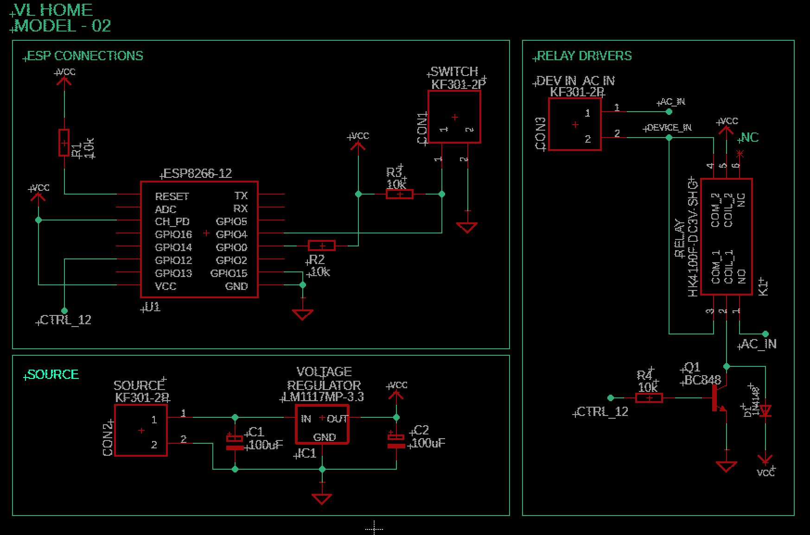
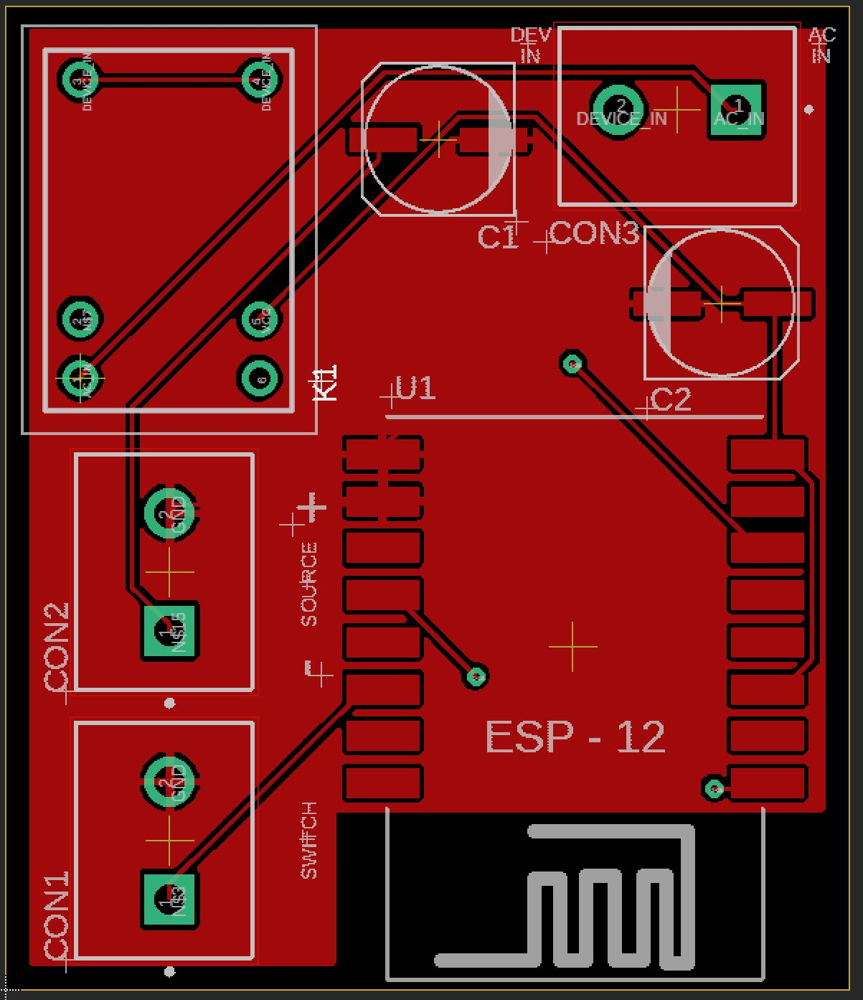
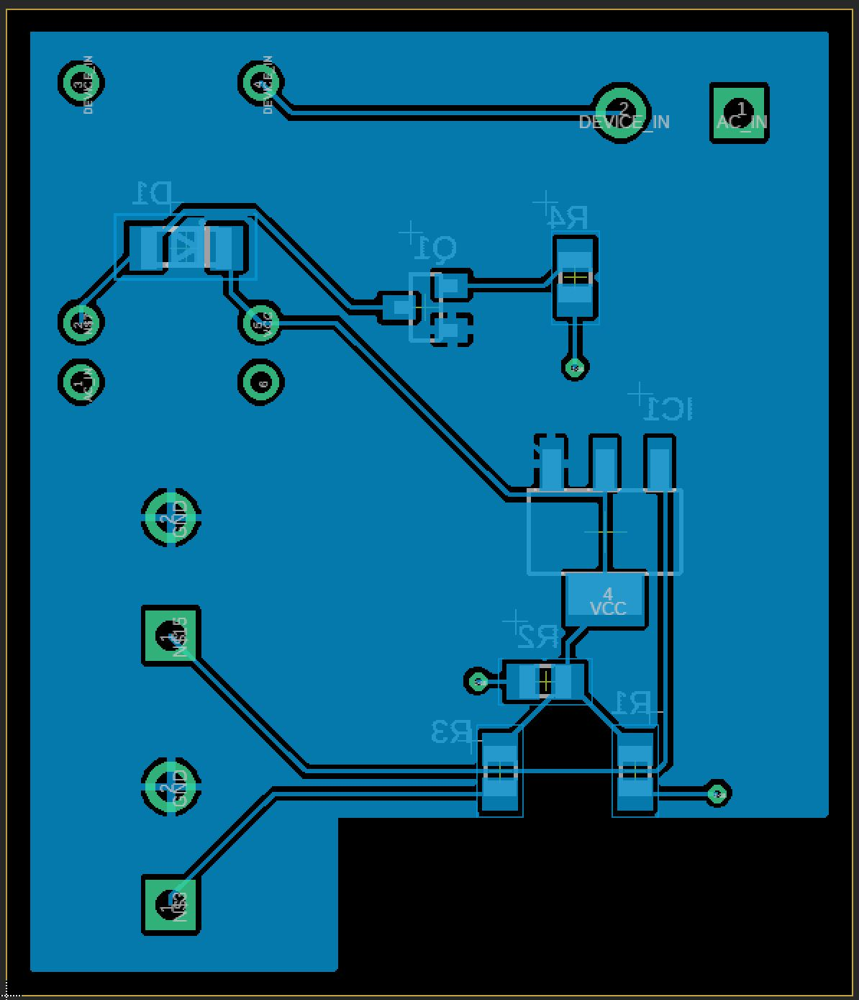
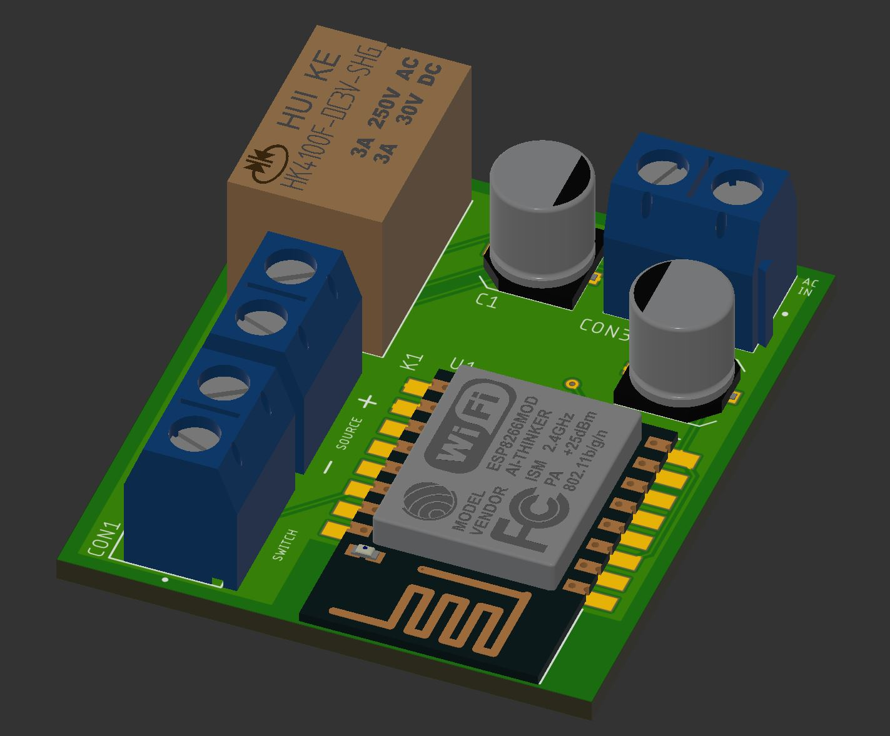
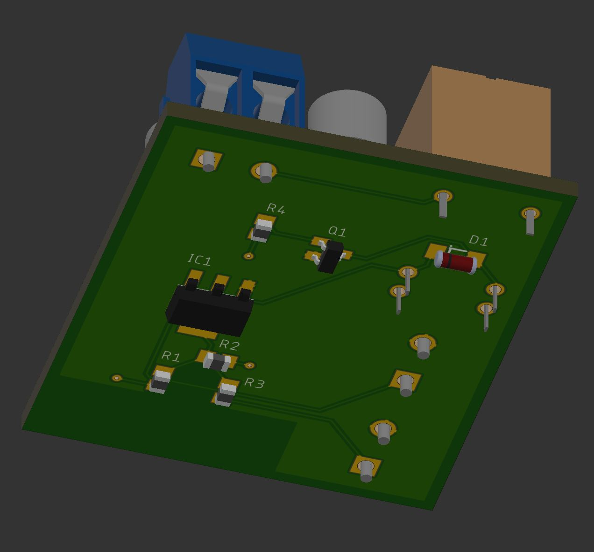

# VLHOME Hardware Firmware - MODEL 02

Remotely activated device through Wifi connection with a Firebase database.

## Project

This software was developed to be used on ESP8266-12 (4Mb flash) microcontroller to controls a high voltage device and connecting to a physical activated switch.

## Operation

the device can be activated through three ways:

### > Application
Through using dedicated Application:  [VLHome App](https://github.com/vilelalabs/vlhome) 

### > Webpage
Through webpage using the addresses:

|Link |Function|
|:----------:|:----------:|
|http://device-IPAdress/|home page that confirms the connection|
|http://device-IPAdress/update|update through OTA|
|http://device-IPAdress/toggle|toggles the current state of the device|
|http://device-IPAdress/hostname|shows the host name of the device|

> example: http://192.168.1.225/update

### > Switch

Can be physically actvated bt the switch linked to CON1 (SWITCH) connector onboard (see images) - this connection is optional.

# Installation 

Until now (version: 1.0) its needed to use an auxiliar application from Espressif to connect the device to the local network. The application used is [EspTouch: SmartConfig for ESP ESP8266, ESP32](https://play.google.com/store/apps/details?id=com.khoazero123.iot_esptouch_demo). On it you will need to put the SSID and password information.

After some time the device is found and it shows the IP address, take note to use the webpage activation method, or even to compare to new device configuration screen (*Novo Dispositivo*) through [App](https://github.com/vilelalabs/vlhome).

From this point  **webpage** and **switch** methods can be used already , but on the **App**, you still need use the menu before: 

**Configurações > Dispositivos > Novo > Buscar Novo Dispositivo**

# Folder eaglefiles

In this folder you will find the necessary files for building the hardware board: 

- Eagle project
- Schematic file (SCH)
- Board file (PCB layout) (BRD) (between the two projects - one/two side only capacitor package is different)
- Bill of Materials file (BOM)
- PDF file with a ready-for-printing page with the board layout.

_* there is two versions for one side cooper and double sided cooper boards, see by file names_
# Images

## Schematic

## Board (PCB)

### Double Sided Board (PCB)
|Top Side |Bottom side|
|:----------:|:----------:|
|||
## 3D View
|Top Side - Single Cooper |Bottom side - Single Cooper|
|:----------:|:----------:|
|||
|Top Side - Double Side Cooper|Bottom side - Double Side Cooper|
|||

